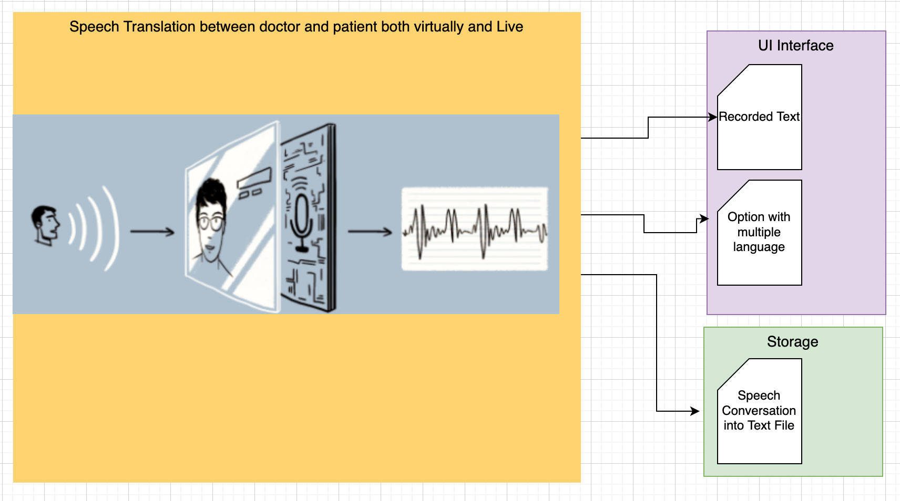

# Team-Gravity
Central Repository for Team Gravity for Virtual Global Hackathon 2020.

# Team-Gravity ( Speech Recognition )

# What's the Problem ?

    1)	One of the most significant challenges in medical practice is documentation. Accurate and timely documentation is critical to proper patient care 
    2)	Details related to history and physical health reports have to be converted to precise and reliable documents. 
    3)	Language differences creates a barrier between the doctor and the patients.

# How can technology help?

    1)	The doctor does not need to capture consultation/ conversation notes with patients
    2)	This tool is a one-stop solution used to remove the communication barrier between doctor and patient

# The idea

    1)	Using Python Speech Recognition, we are recording and converting the doctor and patient conversation into text format.
    2)	Conversation text we are transformed into txt files for future reference, and this will benefit junior doctor for understanding various cases and sceneries
    3)	We have added functionality of converting the conversion into .txt files for checking the history for patients, and this can be shared with the patient via email for historical records.
    4)	We have also added another feature of converting the speech into different languages to overcome the language barrier among people from different places.

# Application Benefit

    1)	Improves patient's experience.
    2)	Benefits junior doctor for understanding various cases.
    3)	Removal of Linguistic barriers.
    4)	Make Information Accessible.

Architecture Diagram : 

 

